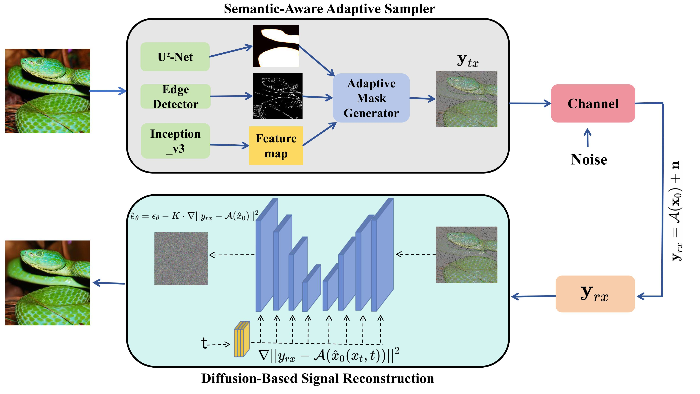

# SemAID: Semantic-Aware Image Transmission via Adaptive Non-Uniform Sampling and Diffusion-Based Posterior Estimation



## 🎉 Our paper has been accepted by ICC

## Abstract
The paradigm of semantic communication prioritizes the recovery of semantically meaningful information over pixel-level fidelity, which is crucial for bandwidth-constrained and extreme environments such as deep-space exploration and disaster response. However, existing deep learning-based approaches often rely on task-specific training and struggle with the compound distortion of aggressive compression and severe channel noise. In this paper, we formulate semantic-aware image transmission as a signal recovery problem from incomplete and noisy measurements, guided by semantic importance. We propose SemAID, a novel framework that integrates an adaptive, semantic-driven non-uniform sampler at the transmitter and a generative diffusion-based Bayesian estimator at the receiver. The transmitter dynamically masks pixels based on saliency and edge information, effectively implementing content-aware compression. The receiver, leveraging a pre-trained diffusion model as a strong generative prior, solves the corresponding inverse problem via posterior sampling without any retraining. Extensive experiments demonstrate that SemAID achieves superior performance in both perceptual quality and reconstruction fidelity under low-SNR conditions, showcasing remarkable generalization across varying channel states and unseen data distributions. This work validates the potent efficacy of generative priors for semantic signal recovery under the compound challenge of non-uniform sampling and channel noise, offering a practical zero-shot solution for extreme communication environments.

## 📁 Project Structure

```

SemAID/
├── configs/                          # Configuration files
│   ├── model_config.yaml             # Model architecture (FFHQ/ImageNet)
│   ├── diffusion_config.yaml         # Diffusion process settings
│   └── task_config.yaml              # Task-specific configs (inpainting, etc.)
│
├── models                          
│
├── main.py                           # Unified experimental script
│
├── guided_diffusion/                 # Core diffusion model code
│
├── util/                             # Utility functions
│   ├── img_utils.py                  # Image processing utilities
│   └── logger.py                     # Logging tools
│
├── U_2_Net/                          # Saliency detection module
│   ├── data_loader.py                
│   └── u2net_saliency.py             # Saliency detector wrapper
│   └── model             
│
├── data/                             # Data loaders
│   └── dataloader.py                 # Dataset loader (FFHQ, ImageNet, Mars)
│
├── requirements.txt                          
│
└── README.md                         # This document

```

## 🚀 Quick Start

### 1. Environment Setup

```bash
Create conda environment
conda create -n SemAID python=3.8
conda activate SemAID

# Install PyTorch (CUDA 11.8)

pip install torch==2.0.0+cu118 torchvision==0.15.0+cu118 --index-url https://download.pytorch.org/whl/cu118

# Install other dependencies
pip install -r requirements.txt

```
### 2. Download Pretrained Models
Model	Purpose	Download Link
[Google Drive](https://drive.google.com/drive/folders/1jElnRoFv7b31fG0v6pTSQkelbSX3xGZh?usp=sharing) download：
- `ffhq_10m.pt` →  `./models/`
- `imagenet256.pt` →  `./models/`
[U²-Net](https://drive.google.com/uc?id=1ao1ovG1Qtx4b7EoskHXmi2E9rp5CHLcZ)
Place these files in the .U_2_Net/model/ directory (create if not exists).

### 3. Prepare Data
FFHQ: Place the validation images in ./data/ffhq/

ImageNet: Extract the validation set into ./data/imagenet/val/ (e.g., tar -xf ILSVRC2012_img_val.tar)

## 📝 Main Features
Unified Experimental Script
Use main.py to run experiments with automatic configuration selection. The script supports two datasets (ffhq, imagenet) and several tasks:

inpainting – Semantic-driven non-uniform masking

Examples:

```bash
# FFHQ dataset with semantic inpainting (dynamic mask based on saliency)
python3 sample_condition_final.py \
    --model_config=configs/model_config.yaml \
    --diffusion_config=configs/diffusion_config.yaml \
    --task_config=configs/inpainting_config.yaml \
    --gpu=0 \
    --save_dir=./results_saliency_step_final_ffhq_SNR_-5_highest \
    --c_rate=0.95 \
    --particle_size=5 \
    --timestep_respacing=200 \
    --u2net_model_path=/home/mxxie/SemAID/U_2_Net/model/u2net.pth \
    --metrics_file=image_metrics.txt \
    --snr_db=-5.0
```

The script automatically:

Loads appropriate configuration files based on dataset and task.

For inpainting, it computes saliency maps with U²‑Net, dynamically adjusts mask ratio based on image complexity, and generates semantic masks with edge protection.

Saves results in structured directories: results/{task_name}/input/, recon/, progress/, label/.


## How It Works
Transmitter (Non-uniform Sampler)

Computes saliency map using U²‑Net.

Detects edges via Canny.

Dynamically adjusts mask ratio based on image complexity (Inception features + traditional statistics).

Generates a semantic mask: high-saliency regions are preserved with higher probability; low-saliency regions are masked more aggressively.

Edge protection ensures important boundaries are retained.

Receiver (Diffusion-based Bayesian Estimator)

Leverages a pretrained diffusion model as a strong prior.

Solves the inverse problem using Diffusion Posterior Sampling (DPS).

Works zero-shot – no retraining required for new tasks or channel conditions.

## 📄 Citation
If you use this code in your research, please cite our paper:

```bibtex
@article{...,
  title={SemAID: Semantic-Aware Image Transmission via Adaptive Non-Uniform Sampling and Diffusion-Based Posterior Estimation},
  author={...},
  journal={ICC},
  year={2025}
}
```
Also acknowledge the original DPS method:

```bibtex
@inproceedings{
chung2023diffusion,
title={Diffusion Posterior Sampling for General Noisy Inverse Problems},
author={Hyungjin Chung and Jeongsol Kim and Michael Thompson Mccann and Marc Louis Klasky and Jong Chul Ye},
booktitle={The Eleventh International Conference on Learning Representations},
year={2023},
url={https://openreview.net/forum?id=OnD9zGAGT0k}
}
```
## 📧 Contact
For questions or issues, please open an issue on GitHub or contact the authors.